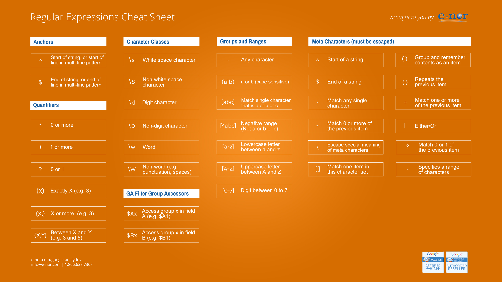

### 变更记录

| 序号 | 录入时间 | 录入人 | 备注 |
|:--------:|:--------:|:--------:|:--------:|
| 1 | 2015-03-02 | [Alfred Jiang](https://github.com/viktyz) | - |
| 2 | 2015-12-23 | [Alfred Jiang](https://github.com/viktyz) | - |
| 3 | 2016-11-15 | [Alfred Jiang](https://github.com/viktyz) | - |

### 方案名称

正则表达式 - 在 iOS 开发中使用正则表达式

### 关键字

正则表达式 \ Email 验证 \ ip 验证 \ 域名验证 \ 手机号码验证 \ 输入验证 \ NSString

### 需求场景

1. 需要对字符串进行正则相关的验证时

### 参考链接

1. [RegexKit Framework](http://regexkit.sourceforge.net/)
2. [RegexKitLite](http://regexkit.sourceforge.net/RegexKitLite/index.html#NSString_RegexKitLiteAdditions__Xcode3IntegratedDocumentation)
3. [博客园 - iOS NSPredicate和正则表达式](http://www.cnblogs.com/wfwenchao/p/4307992.html)
4. [Regexper](http://regexper.com/) : 正则表达式可视化
5. [deerchao - 正则表达式30分钟入门教程](http://deerchao.net/tutorials/regex/regex.htm)

### 详细内容

##### 正则表达式的相关语法


[Google Analytics Regex and Keyboard Shortcuts Desktop Backgrounds](https://www.e-nor.com/blog/google-analytics/google-analytics-regex-and-keyboard-shortcuts-desktop-backgrounds)

##### 使用方法

1. 去 *RegexKitLite* 下载类库，解压出来会有一个例子包及 2 个文件，其实用到的就这 2 个文件，添加到工程中。

2. 工程中添加 *libicucore.dylib frameworks* 。

3. 现在所有的 *NSString* 对象就可以调用 *RegexKitLite* 中的方法了。
```objective-c
NSString *email = @”kkk@aaa.com”;
[email isMatchedByRegex:@"\\b([a-zA-Z0-9%_.+\\-]+)@([a-zA-Z0-9.\\-]+?\\.[a-zA-Z]{2,6})\\b”];
```

返回 *YES* ，证明是 *email* 格式，需要注意的是 *RegexKitLite* 用到的正则表达式和 *wiki* 上的略有区别。

取 *string* 中 *http* 端口的例子。
```objective-c
NSString *searchString = @"http://www.example.com:8080/index.html";
NSString *regexString = @"\\bhttps?://[a-zA-Z0-9\\-.]+(?::(\\d+))?(?:(?:/[a-zA-Z0-9\\-._?,'+\\&%$=~*!():@\\\\]*)+)?";
NSInteger portInteger = [[searchString stringByMatching:regexString capture:1L] integerValue];
NSLog(@"portInteger: '%ld'", (long)portInteger);

//portInteger: '8080'
```

##### 常用正则表达式
```
    匹配双字节字符(包括汉字在内)：[^x00-xff]

    评注：可以用来计算字符串的长度（一个双字节字符长度计2，ASCII字符计1）

    匹配空白行的正则表达式：ns*r

    评注：可以用来删除空白行

    匹配HTML标记的正则表达式：<(S*?)[^>]*>.*?|<.*? />

    评注：网上流传的版本太糟糕，上面这个也仅仅能匹配部分，对于复杂的嵌套标记依旧无能为力

    匹配首尾空白字符的正则表达式：^s*|s*$

    评注：可以用来删除行首行尾的空白字符(包括空格、制表符、换页符等等)，非常有用的表达式

    匹配Email地址的正则表达式：w+([-+.]w+)*@w+([-.]w+)*.w+([-.]w+)*

    评注：表单验证时很实用

    匹配网址URL的正则表达式：[a-zA-z]+://[^s]*

    评注：网上流传的版本功能很有限，上面这个基本可以满足需求

    匹配帐号是否合法(字母开头，允许5-16字节，允许字母数字下划线)：^[a-zA-Z][a-zA-Z0-9_]{4,15}$

    评注：表单验证时很实用

    匹配国内电话号码：d{3}-d{8}|d{4}-d{7}

    评注：匹配形式如 0511-4405222 或 021-87888822

    匹配腾讯QQ号：[1-9][0-9]{4,}

    评注：腾讯QQ号从10000开始

    匹配中国邮政编码：[1-9]d{5}(?!d)

    评注：中国邮政编码为6位数字

    匹配身份证：d{15}|d{18}

    评注：中国的身份证为15位或18位

    匹配ip地址：d+.d+.d+.d+ 或 (\\d*\\.){3}\\d*

    评注：提取ip地址时有用

    匹配特定数字：

    ^[1-9]d*$　 　 //匹配正整数

    ^-[1-9]d*$ 　 //匹配负整数

    ^-?[1-9]d*$　　 //匹配整数

    ^[1-9]d*|0$　 //匹配非负整数（正整数 + 0）

    ^-[1-9]d*|0$　　 //匹配非正整数（负整数 + 0）

    ^[1-9]d*.d*|0.d*[1-9]d*$　　 //匹配正浮点数

    ^-([1-9]d*.d*|0.d*[1-9]d*)$　 //匹配负浮点数

    ^-?([1-9]d*.d*|0.d*[1-9]d*|0?.0+|0)$　 //匹配浮点数

    ^[1-9]d*.d*|0.d*[1-9]d*|0?.0+|0$　　 //匹配非负浮点数（正浮点数 + 0）

    ^(-([1-9]d*.d*|0.d*[1-9]d*))|0?.0+|0$　　//匹配非正浮点数（负浮点数 + 0）

    评注：处理大量数据时有用，具体应用时注意修正

    匹配特定字符串：

    ^[A-Za-z]+$　　//匹配由26个英文字母组成的字符串

    ^[A-Z]+$　　//匹配由26个英文字母的大写组成的字符串

    ^[a-z]+$　　//匹配由26个英文字母的小写组成的字符串

    ^[A-Za-z0-9]+$　　//匹配由数字和26个英文字母组成的字符串

    ^w+$　　//匹配由数字、26个英文字母或者下划线组成的字符串

    在使用RegularExpressionValidator验证控件时的验证功能及其验证表达式介绍如下:

    只能输入数字：“^[0-9]*$”

    只能输入n位的数字：“^d{n}$”

    只能输入至少n位数字：“^d{n,}$”

    只能输入m-n位的数字：“^d{m,n}$”

    只能输入零和非零开头的数字：“^(0|[1-9][0-9]*)$”

    只能输入有两位小数的正实数：“^[0-9]+(.[0-9]{2})?$”

    只能输入有1-3位小数的正实数：“^[0-9]+(.[0-9]{1,3})?$”

    只能输入非零的正整数：“^+?[1-9][0-9]*$”

    只能输入非零的负整数：“^-[1-9][0-9]*$”

    只能输入长度为3的字符：“^.{3}$”

    只能输入由26个英文字母组成的字符串：“^[A-Za-z]+$”

    只能输入由26个大写英文字母组成的字符串：“^[A-Z]+$”

    只能输入由26个小写英文字母组成的字符串：“^[a-z]+$”

    只能输入由数字和26个英文字母组成的字符串：“^[A-Za-z0-9]+$”

    只能输入由数字、26个英文字母或者下划线组成的字符串：“^w+$”

    验证用户密码:“^[a-zA-Z]w{5,17}$”正确格式为：以字母开头，长度在6-18之间，

    只能包含字符、数字和下划线。

    验证是否含有^%&',;=?$"等字符：“[^%&',;=?$x22]+”

    只能输入汉字：“^[u4e00-u9fa5],{0,}$”

    验证Email地址：“^w+[-+.]w+)*@w+([-.]w+)*.w+([-.]w+)*$”

    验证InternetURL：“^http://([w-]+.)+[w-]+(/[w-./?%&=]*)?$”

    验证电话号码：“^((d{3,4})|d{3,4}-)?d{7,8}$”

    正确格式为：“XXXX-XXXXXXX”，“XXXX-XXXXXXXX”，“XXX-XXXXXXX”，

    “XXX-XXXXXXXX”，“XXXXXXX”，“XXXXXXXX”。

    验证身份证号（15位或18位数字）：“^d{15}|d{}18$”

    验证一年的12个月：“^(0?[1-9]|1[0-2])$”正确格式为：“01”-“09”和“1”“12”

    验证一个月的31天：“^((0?[1-9])|((1|2)[0-9])|30|31)$”

    正确格式为：“01”“09”和“1”“31”。

    匹配中文字符的正则表达式： [u4e00-u9fa5]

    匹配双字节字符(包括汉字在内)：[^x00-xff]

    匹配空行的正则表达式：n[s| ]*r

    匹配HTML标记的正则表达式：/<(.*)>.*|<(.*) />/

    匹配首尾空格的正则表达式：(^s*)|(s*$)

    匹配Email地址的正则表达式：w+([-+.]w+)*@w+([-.]w+)*.w+([-.]w+)*

    匹配网址URL的正则表达式：[url=http://%28[w-]+.%29+[w-]+%28/[w]http://([w-]+.)+[w-]+(/[w[/url]- ./?%&=]*)?

    获取域名：([a-zA-Z0-9]([a-zA-Z0-9\-]{0,61}[a-zA-Z0-9])?\.)+[a-zA-Z]{2,6}(?=/)
```

##### 收集自 [GitHub - AnneBlair/YYGRegular](https://github.com/AnneBlair/YYGRegular/blob/master/YYGRegular/YYGRegular/YYGRegular.swift)

```swift
//
//  YYGRegular.swift
//  Ecshop
//
//  Created by 区块国际－yin on 16/11/3.
//  Copyright © 2016年 区块国际－yin. All rights reserved.
//
import UIKit

public struct RegexHelper {
    
    let regex: NSRegularExpression
    
    init(_ pattern: String) throws {
        try regex = NSRegularExpression(pattern: pattern, options: .caseInsensitive)
    }
    
    func match(_ input: String) -> Bool {
        let matches = regex.matches(in: input, options: [], range: NSMakeRange(0, input.utf16.count))
        return matches.count > 0
    }
    
}

//swift 中新加操作符的时候需要先对其进行声明，告诉编译器这个符合其实是一个操作符合
//precedencegroup 定义了一个操作符的优先级别
precedencegroup MatchPrecedence {
    //associativity 定义了结合定律，多个同类操作符顺序出现的计算顺序
    associativity: none
    //higherThan 运算的优先级
    higherThan: DefaultPrecedence
}

//infix 表示定位的是一个中位操作符，意思是前后都是输入；
//其他的修饰子还包括prefix和postfix
infix operator =~: MatchPrecedence

public func =~(object: String, template: String) -> Bool {
    do {
        return try RegexHelper(template).match(object)
    } catch _ {
        return false
    }
}

/// 邮箱匹配
let mail: String = "^([a-z0-9_\\.-]+)@([\\da-z\\.-]+)\\.([a-z\\.]{2,6})$"

/// 匹配用户名 字面或者数字组合 4到16位
let Username: String = "^[a-z0-9_-]{4,16}$"

/// 匹配密码 字面加下划线，6到18位
let Password: String = "^[a-z0-9_-]{6,18}$"

/// 匹配16进制
let HexValue: String = "^#?([a-f0-9]{6}|[a-f0-9]{3})$"

///内容带分割符号 “Anne-Blair”
let Slug: String = "^[a-z0-9-]+$"

/// 匹配URL
let isURL: String = "^(https?:\\/\\/)?([\\da-z\\.-]+)\\.([a-z\\.]{2,6})([\\/\\w \\.-]*)*\\/?$"

/// 匹配IP地址
let IPAddress: String = "^(?:(?:25[0-5]|2[0-4][0-9]|[01]?[0-9][0-9]?)\\.){3}(?:25[0-5]|2[0-4][0-9]|[01]?[0-9][0-9]?)$"

/// 是HTML <center>内容<\center>  符合
let HTMLTag: String = "^<([a-z]+)([^<]+)*(?:>(.*)<\\/\\1>|\\s+\\/>)$"

/// 日期(年-月-日)
let isDate1: String = "(\\d{4}|\\d{2})-((1[0-2])|(0?[1-9]))-(([12][0-9])|(3[01])|(0?[1-9]))"

/// 日期(月/日/年)
let isDate2: String = "((1[0-2])|(0?[1-9]))/(([12][0-9])|(3[01])|(0?[1-9]))/(\\d{4}|\\d{2})"

/// 时间(小时:分钟, 24小时制)
let TimeFormat: String = "((1|0?)[0-9]|2[0-3]):([0-5][0-9])"

/// 是汉字
let isChinese: String = "[\\u4e00-\\u9fa5]"

/// 中文及全角标点符号(字符)
let ChineseParagraph: String = "[\\u3000-\\u301e\\ufe10-\\ufe19\\ufe30-\\ufe44\\ufe50-\\ufe6b\\uff01-\\uffee]"

/// 中国大陆固定电话号码
let fixedLineTelephone: String = "(\\d{4}-|\\d{3}-)?(\\d{8}|\\d{7})"

/// 中国大陆身份证号(15位或18位)
let IdNum: String = "\\d{15}(\\d\\d[0-9xX])?"

/// 手机号
let isIphoneNum: String = "1\\d{10}"

/// 邮政编码
let zipCode: String = "[1-9]\\d{5}"

///获取域名

let host: String = "([a-zA-Z0-9]([a-zA-Z0-9\-]{0,61}[a-zA-Z0-9])?\.)+[a-zA-Z]{2,6}(?=/)"

```

##### 示例
```objective-c
//判断是否为邮件地址
+ (BOOL)isEmailAddress:(NSString *)email  
{  
    NSString *emailRegex = @"[A-Z0-9a-z._%+-]+@[A-Za-z0-9.-]+\\.[A-Za-z]{2,4}";
    NSPredicate *emailTest = [NSPredicate predicateWithFormat:@"SELF MATCHES %@", emailRegex]; 
    return [emailTest evaluateWithObject:email];  
}

//判断是否为 ip 地址
+ (BOOL)isIPAddress:(NSString *)url  
{  
    NSString *ipRegex = @"(\\d*\\.){3}\\d*";
    NSPredicate *ipTest = [NSPredicate predicateWithFormat:@"SELF MATCHES %@", ipRegex]; 
    return [ipTest evaluateWithObject:url];  
}

//获取域名
+ (NSString *)fetchHost:(NSString *)url
{
    return [url stringByMatching:@"([a-zA-Z0-9]([a-zA-Z0-9\\-]{0,61}[a-zA-Z0-9])?\\.)+[a-zA-Z]{2,6}(?=/)"];
}
```

### 效果图
（无）

### 备注

* [JavaScript - 正则表达式介绍](../JavaScript/JavaScript_00002_20160130.md)