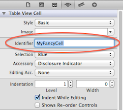
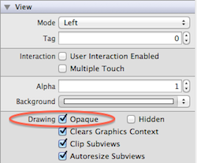
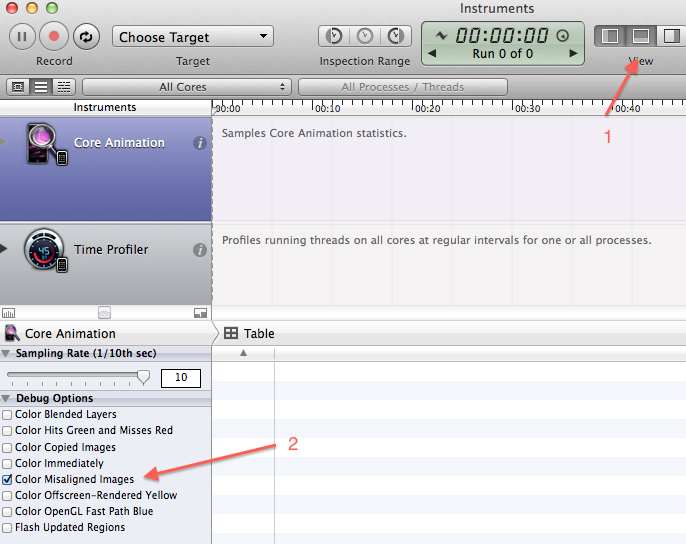

### 变更记录

| 序号 | 录入时间 | 录入人 | 备注 |
|:--------:|:--------:|:--------:|:--------:|
| 1 | 2015-09-08 | [Alfred Jiang](https://github.com/viktyz) | - |
| 2 | 2015-12-23 | [Alfred Jiang](https://github.com/viktyz) | - |

### 方案名称

UITableView - 滑动加载性能优化总结

### 关键字

UITableView \ UITableViewCell \ reloadData \ 列表 \ 滑动 \ 卡顿 \ 性能优化

### 需求场景

1. 实现较为复杂的 UITableViewCell 列表和加载大量数据时

### 参考链接

1. [CocoaChina - 一次 TableView 性能优化经历](http://www.cocoachina.com/ios/20150906/13212.html)
2. [伯乐在线 - iOS应用性能调优的25个建议和技巧](http://blog.jobbole.com/37984/)
3. [iOS App性能优化](http://www.hrchen.com/2013/05/performance-with-instruments/)
4. [GitHub - UITableView优化技巧](http://longxdragon.github.io/2015/05/26/UITableView优化技巧/)
5. [UITableView 滚动流畅性优化](http://blog.cocoabit.com/2014-02-09-uitableview-gun-dong-liu-cheng-xing-you-hua/)

### 详细内容

##### 1. 列表卡顿问题最好真机测试，有条件的尽量选择低版本硬件和系统进行测试；
##### 2. 使用 Instruments 的 Time Profiler 工具定位造成卡顿时间消耗的位置；
##### 3. 避免 UITableView 的多次刷新( reloadData )，尤其 Xib 加载 UITableView 时避免首次自动加载；
##### 4. 为 Cell 专门定义显示 Model；
##### 5. Model 需要包含已提前计算出的 Cell 高度；
##### 6. 对于显示的 NSString，提前在 Model 中组装完成，避免在 Cell 中组装转换；
##### 7. 对于需要加载的网络图片链接，提前在 Model 中组装完成 NSURL,避免在 Cell 中组装转换；
##### 8. 尽量减少 Cell 中的逻辑判断和运算并使用正确的数据格式;
##### 9. 避免在 Cell 中反复创建 View,最好在初始化时一并创建，通过设置 Hidden 属性控制显示和隐藏;
##### 10. 对于 UIImageView ,注意加载的图片大小是否与控件大小一致，尽量保持一致；
##### 11. 正确使用 reuseIdentifier



```objective-c
static NSString *CellIdentifier = @"MyFancyCell";
UITableViewCell *cell = [tableView dequeueReusableCellWithIdentifier:CellIdentifier forIndexPath:indexPath];
```

##### 12. 尽量把所有的 UIView 以及其子类控件设置为不透明（Opaque = YES）,你可以在模拟器中用Debug\Color Blended Layers选项来发现哪些view没有被设置为opaque。目标就是，能设为opaque的就全设为opaque!



##### 13. 尽量避免图片压缩，模拟器条件下使用 Debug\Color Misaligned Images 选项检查像素是否对其:如果图片边界没有与目标像素完美对齐，该功能可为图片叠加上一层品红色。如果图片使用确定的比例大小绘制，那么该功能会为图片添加一层黄色叠加。真机条件下使用 Instrument 中的 Core Animation 工具检查；



##### 14. 使用 *shadowPath* 来画阴影;
```objective-c
#import <QuartzCore/QuartzCore.h>

// Somewhere later ...
UIView *view = [[UIView alloc] init];

// Setup the shadow ...
view.layer.shadowOffset = CGSizeMake(-1.0f, 1.0f);
view.layer.shadowRadius = 5.0f;
view.layer.shadowOpacity = 0.6;
```

##### 15. 减少 subviews 的数量;
##### 16. 尽量不使用 *cellForRowAtIndexPath:* ，如果你需要用到它，只用一次然后缓存结果；
##### 17. 使用 Autorelease Pool；
```objective-c
NSArray *urls = <# An array of file URLs #>;
for (NSURL *url in urls) {
    @autoreleasepool {
        NSError *error;
        NSString *fileContents = [NSString stringWithContentsOfURL:url
                                         encoding:NSUTF8StringEncoding error:&error];
    }
}
```

##### 18. 选择是否需要缓存；
```objective-c
UIImage *img = [UIImage imageNamed:@"myImage"];
// caching

// or
 UIImage *img = [UIImage imageWithContentsOfFile:@"myImage"];
// no caching
```

如果你要加载一个大图片而且是一次性使用，那么就没必要缓存这个图片，用 *imageWithContentsOfFile* 足矣，这样不会浪费内存来缓存它。然而，在图片反复重用的情况下 *imageNamed* 是一个好得多的选择。

##### 19. 避免日期格式转换；相关日期显示应该在 Model 中定义完成。

### 效果图
（无）

### 备注

* [UITableViewCell - 通过 UITableViewCell 界面外壳优化列表滑动显示](Note_00230_20170706.md)
